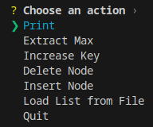
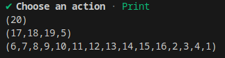

# D-ary Heap

## Description
This Rust project implements a d-ary heap, a variant of the binary heap where each node has 'd' children instead of 2. It provides a command-line interface (CLI) for users to perform various operations on the d-ary heap, showcasing the efficiency and capabilities of a d-ary heap in Rust.

## Features
- **Dynamic Branching Factor**: Customize the heap structure by specifying the 'd' value.
- **Heap Operations**: Support for insert, delete, and extract maximum element.
- **Key Increase**: Functionality to increase the value of a key at a given node.
- **Interactive CLI**: User-friendly command-line interface for heap operations.
- **File Input**: Load heap data from a file for enhanced usability and testing.
- **Heap State Display**: Visualize the heap's state after each operation.

## Usage
```
Usage: dheap [OPTIONS] -d <max-nodes>

Options:
  -d <max-nodes>    What's the "d" of the heap, i.e., how many children can each node have?
  -f <filepath>     The optional path to the comma separated list of numbers, e.g., 2,3,4,5
```
For example:  
```dheap -f ./list -d 4```

  
